# DLP Lab 2

## Introduction
In this lab, I'm going to implement two deep convolutional neural network architectures, VGG19 and ResNet50, to classify the Butterfly & Moth dataset. The dataset contains 12,594 training images, 500 validation images, and 500 test images.
I will compare the performance of these two models based on the accuracy of the classification task and discuss the results.

## Implementation Details
### Dataloader
The dataloader is implemented in [_dataset/dataset.py_](./dataset/dataset.py). 
The dataloader loads the images from the dataset and applies the transformations to the images (train/valid and test have different transformations, discussed in [Preprocessing](##Preprocessing)).
At the initialization stage,  all the images are loaded into memory to minimize I/O during training time.
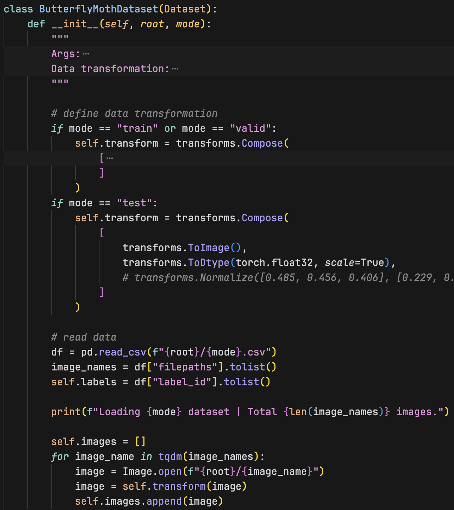
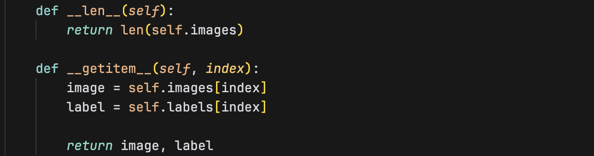

### VGG19
The VGG19 model is implemented in [_model/VGGNet.py_](./model/VGGNet.py).
Here's an overview of the VGG19 model architecture:
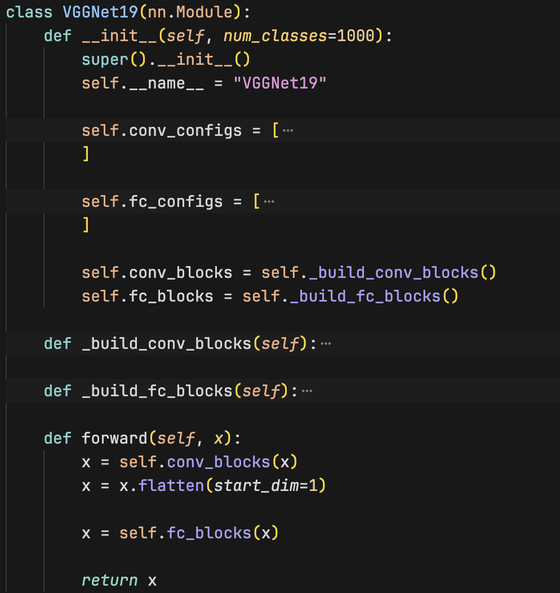

The model is seperated into two parts, the feature extractor and the classifier. 
The feature extractor consists of 16 convolutional layers and 5 max pooling layers. It's defined and constructed with the `_build_conv_blocks` function. Each 2D convolutional layer is followed by a `BatchNorm2d` batch normalization function and a `ReLU` activation function. The batch normalization function normalizes the input to the next layer, which helps the model to converge faster and prevents overfitting. A max pooling layer is added after every block of convolutional layers to reduce the spatial dimensions of the feature maps.
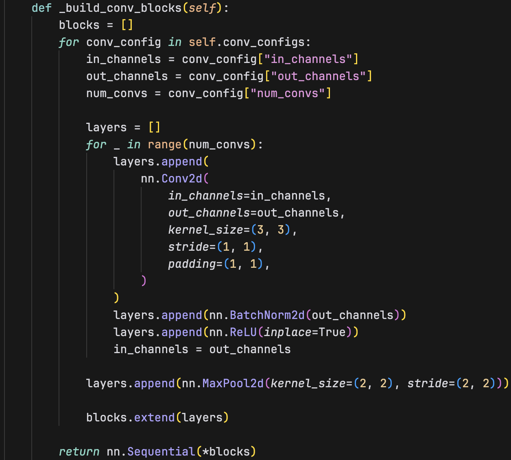
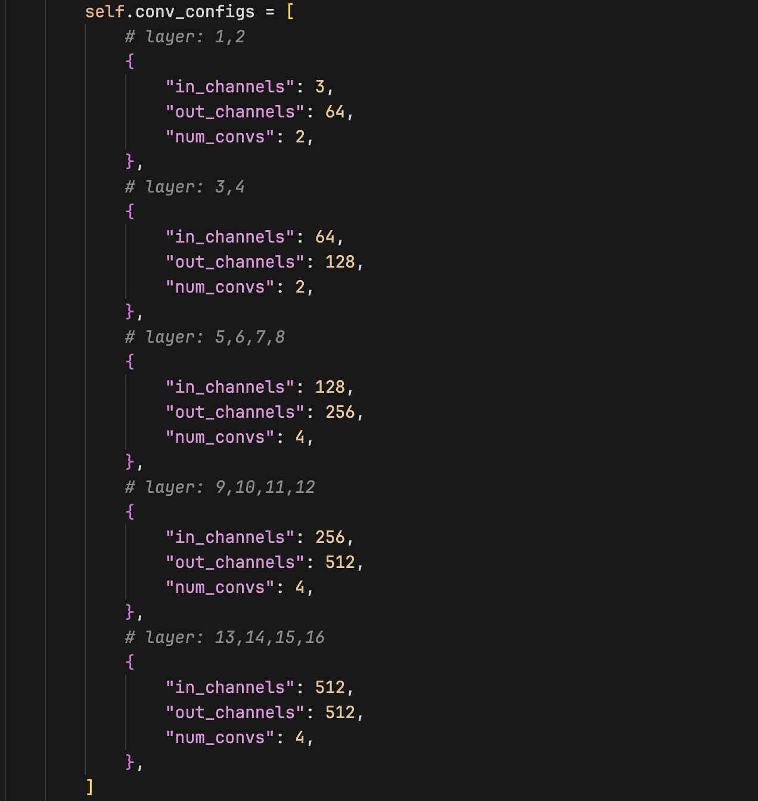

The classifier consists of 3 fully connected layers. The classifier is defined and constructed with the `_build_fc_blocks` function. Each fully connected layer, except the last one, is followed by a `ReLU` activation function and a `Dropout` function. This also increases the model's generalization ability and prevents overfitting.
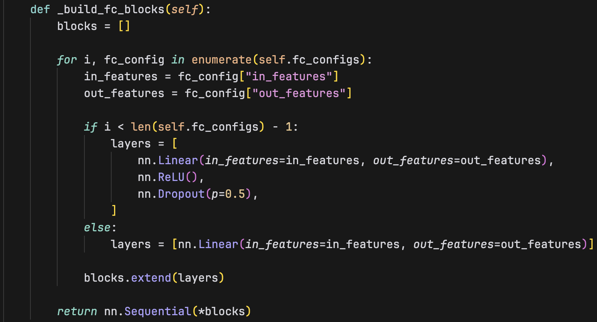
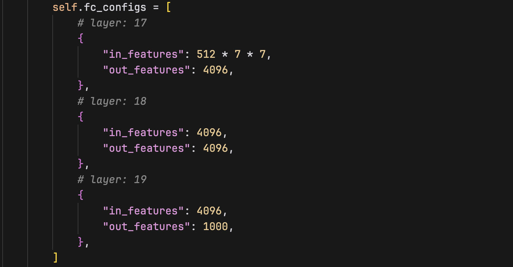

The model is trained using the cross-entropy loss function and the SGD optimizer.

### ResNet50
The ResNet50 model is implemented in [_model/ResNet.py_](./model/ResNet.py).
There are 4 main layers, each layer consists of several residual blocks. After passing through the 4 convolutional layers, the output is passed through a global average pooling layer and a fully connected layer to get the final output.
Here's an overview of the ResNet50 model architecture:
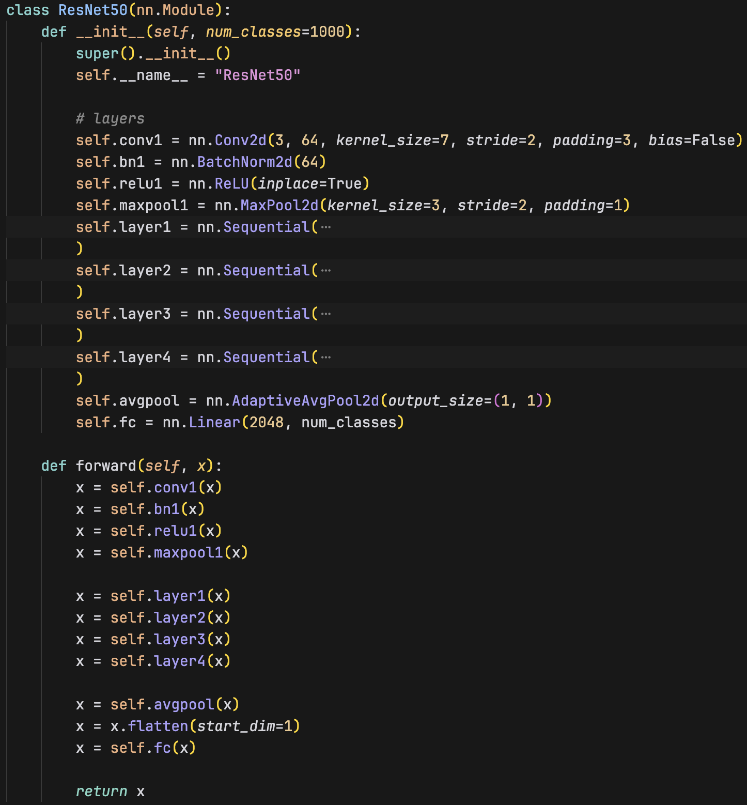

The main component of the ResNet model is the BottleNeck, where the residual block is implemented.
The input x is first copy in a `identity` variable, and then it goes through a series of convolutional layers. The output of the convolutional layers is added to the `identity` variable, and then it goes through a `ReLU` activation function. This forms a residual block, and it helps the model to avoid the vanishing gradient problem.
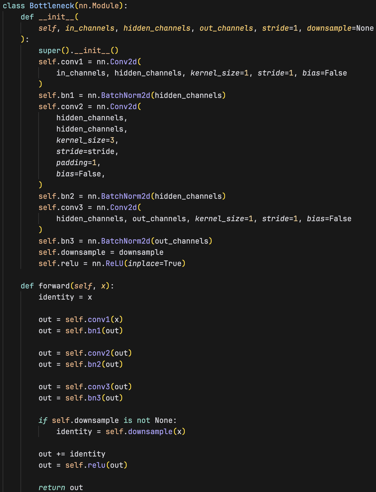

The model is trained using the cross-entropy loss function and the SGD optimizer.

## Preprocessing
First, I trained the model without any data augmentation. The images are only converted into tensors between 0 and 1 and their channels are permuted to C x H x W.
And to my surprise, the model performed well even without data augmentation. The VGG19 model achieved a testing accuracy of **92.40%**, and the ResNet50 model achieved a testing accuracy of **92.60%**.
Then, I decided to add some data augmentations to the training process to see if it furthur improves the model's performance.
I've tried several method to preprocess the data, here are some methods that I've tried and decided to use/not to use:
- ✅ Random horizontal flip: I find random horizontal flip useful for this dataset. The dataset contains images of butterflies and moths, and the orientation of the images doesn't affect the classification. And if we inspect the dataset, some images are just the other one flipped horizontally.
- ✅ Random vertical flip: Vertical flip is as useful as horizontal flip for the same reason.
- ✅ Random rotation: I also find random rotation useful for this dataset for similar reasons. The orientation of the images does not affect the classification. Hence, I thought of it as a good data augmentation method.
- ❌ Color jittering: I find color jittering not working well with this dataset. My guess is that the dataset images are colorful and have a lot of details. Classification between certain classes are led by the color differences, and by randomly color jittering the dataset, it might create confusion to the model. So I didn't use color jittering in the data augmentation process.

## Experimental results
### VGG19
Highest testing accuracy: **92.40%**
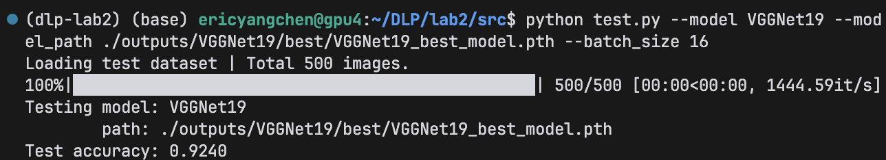

### ResNet50
Highest testing accuracy: **92.60%**
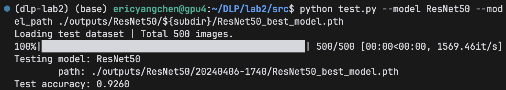

### Comparison: VGG19 vs. ResNet50
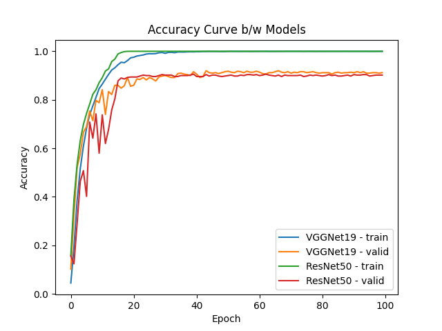

The VGGNet19 and ResNet50 model both perform well on the Butterfly & Moth dataset. The ResNet50 model achieves a testing accuracy of **92.60%**, while the VGG19 model achieves a testing accuracy of **92.40%**. The ResNet50 model achieves a slightly higher testing accuracy than the VGG19 model. 

Overall speaking, the ResNet model outperforms the VGG model in terms of accuracy (on both validation and testing). The ResNet model aviods the vanishing gradient problem, so it's theoretically more robust and it generalizes better than the VGG model.

## Discussion
Besides comparing the performance between the two self-implemented models, I also compared the performance with the Pytorch implemented models. 
I trained the Pytorch implemented VGG19 and ResNet50 models using `torchvision.models.vgg19` and `torchvision.models.resnet50` functions to get the model architectures and train it from scratch (no pre-trained weights). And the results are as follows:
| Model                    | Train (%) | Valid (%) | Test (%)  |
| ------------------------ | --------- | --------- | --------- |
| **VGG19** (_Pytorch_)    | 99.94     | 75.40     | 74.60     |
| **VGG19** (_My Best_)    | 99.99     | **92.00** | 92.40     |
| **ResNet50** (_Pytorch_) | 100.00    | 80.60     | 82.20     |
| **ResNet50** (_My Best_) | 100.00    | 90.60     | **92.60** |

If we compare our models with the Pytorch-implemented ones, we can see that our models outperform them by a margin, especially in terms of validation and testing accuracy. I looked into the model architectures and found some differences that could potentially lead to the conclusion.
For VGG19, the Pytorch-implemented model has an extra adaptive average pooling, and my version doesn't. But, my model performs batch normalization after each convolutional layer, which the Pytorch version doesn't. I think that's how my model achieves a higher training accuracy than the Pytorch-implemented one.
